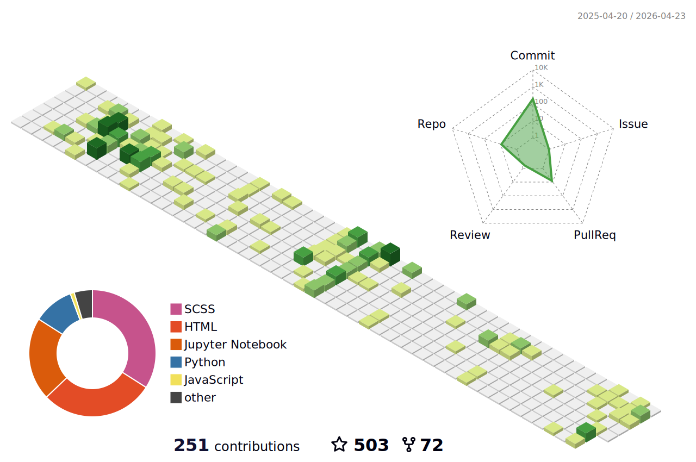

### Hi there 👋

<!--  -->
- 🐹 This is Qiushi Sun, a Ph.D. student at HKU.
- 📫 Connect with me:  
<!--  -->
<!--  -->
- 🏠 Homepage: [qiushisun.github.io](https://qiushisun.github.io/)

<!--
**QiushiSun/QiushiSun** is a ✨ _special_ ✨ repository because its `README.md` (this file) appears on your GitHub profile.

Here are some ideas to get you started:

- 🔭 I’m currently working on ...
- 🌱 I’m currently learning ...
- 👯 I’m looking to collaborate on ...
- 🤔 I’m looking for help with ...
- 💬 Ask me about ...
- 📫 How to reach me: ...
- 😄 Pronouns: ...
- ⚡ Fun fact: ...
-->

<!--  -->

